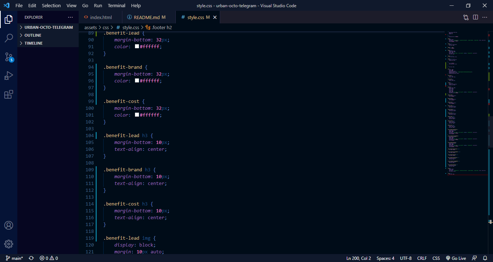

# Horiseon - Refactoring

## Description

The purpose of this activity was to refactor the html and the css of the given code so to make it cleaner, more accessible, and more SEO friendly.

## Website

The website still looks the same after improvements on the code

## Code

The code was functional however it was poorly written. Not only did it communicate its sections very poorly, but it was difficult for another code to identify it parts.

- *HTML Before*

- *HTML Now*
The sections now have meaningful semantic names:

The Style Sheet has been improved as well:
- *CSS Before*

- *CSS Now*

## Credits

This code was worked upon by Xander Rapstine and Luiz Padredi.\n
It was originally written by Xander Rapstine, and Luiz Padredi improved the code's semantic.

